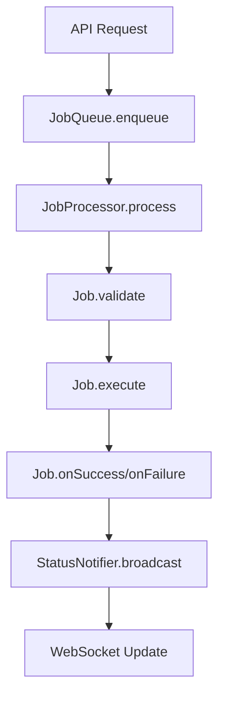
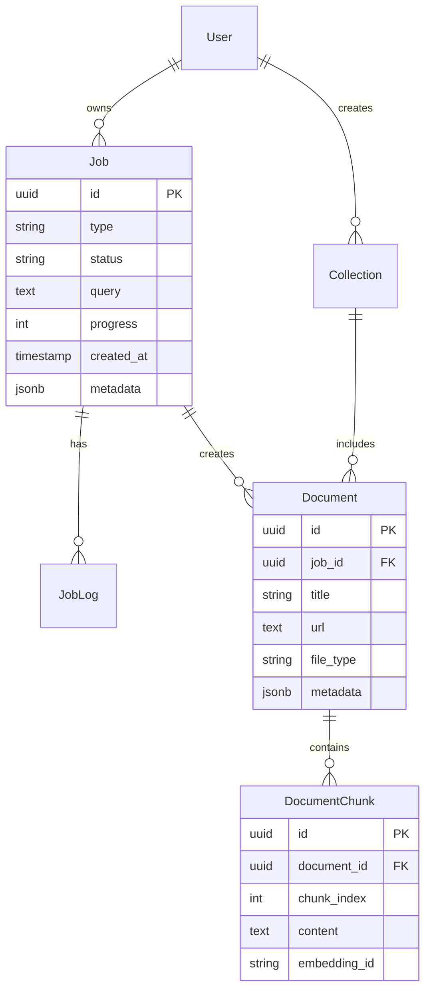

# DataCollector Architecture Guide

This document outlines the architectural decisions, patterns, and conventions used in the DataCollector project.

## 📁 Directory Structure Conventions

### Backend Structure Clarification

```
packages/backend/src/
├── types/                    # TypeScript type definitions and interfaces
│   ├── api.ts               # API request/response DTOs
│   ├── job.ts               # Job-related interfaces and enums
│   ├── search.ts            # Search query and result types
│   ├── websocket.ts         # WebSocket message types
│   └── common.ts            # Shared utility types
├── models/                   # Database schema models (ORM entities)
│   ├── Job.ts               # Database job entity/schema
│   ├── Document.ts          # Database document entity/schema
│   ├── Collection.ts        # Database collection entity/schema
│   └── User.ts              # Database user entity/schema
├── services/
│   ├── queue/               # Job queue infrastructure
│   │   ├── JobProcessor.ts  # Generic job processing engine
│   │   ├── JobQueue.ts      # Queue management
│   │   └── JobScheduler.ts  # Job scheduling logic
│   ├── jobs/                # Specific job implementations
│   │   ├── BaseJob.ts       # Abstract base job class
│   │   ├── CollectionJob.ts # Data collection job implementation
│   │   ├── ProcessingJob.ts # File processing job implementation
│   │   └── IndexingJob.ts   # Search indexing job implementation
│   └── ...
```

### Clear Distinctions

#### `types/` Directory
**Purpose**: General TypeScript type definitions, interfaces, and DTOs that don't directly map to database entities.

**Contains**:
- API request/response interfaces
- Configuration types
- Service layer interfaces
- Utility types and generics
- External API type definitions
- WebSocket message schemas

**Example**:
```typescript
// types/api.ts
export interface CreateCollectionRequest {
  query: string;
  sources?: string[];
  options?: CollectionOptions;
}

export interface JobStatusResponse {
  id: string;
  status: JobStatus;
  progress: number;
  message?: string;
}
```

#### `models/` Directory
**Purpose**: Database schema models that directly map to your database tables/documents, especially when using an ORM.

**Contains**:
- Database entity definitions
- ORM model classes
- Database schema mappings
- Entity relationships
- Database-specific validations

**Example**:
```typescript
// models/Job.ts (using a hypothetical ORM)
@Entity('jobs')
export class Job {
  @PrimaryGeneratedColumn('uuid')
  id: string;

  @Column()
  type: string;

  @Column()
  status: JobStatus;

  @Column('text')
  query: string;

  // ... other database fields
}
```

## 🔄 Job Processing Architecture

### Core Pattern

The job processing system follows a clear separation of concerns:

1. **JobProcessor**: Generic engine that manages job lifecycle
2. **BaseJob**: Abstract base class with common job functionality
3. **Specific Jobs**: Concrete implementations for different job types

### Job Processing Flow



### Implementation Pattern

#### 1. Generic Job Processor (`services/queue/JobProcessor.ts`)
```typescript
export class JobProcessor {
  async process(jobData: JobData): Promise<void> {
    const job = this.createJobInstance(jobData);
    
    try {
      await job.validate();
      await job.execute();
      await job.onSuccess();
    } catch (error) {
      await job.onFailure(error);
    }
  }
  
  private createJobInstance(jobData: JobData): BaseJob {
    switch (jobData.type) {
      case 'collection': return new CollectionJob(jobData);
      case 'processing': return new ProcessingJob(jobData);
      case 'indexing': return new IndexingJob(jobData);
      default: throw new Error(`Unknown job type: ${jobData.type}`);
    }
  }
}
```

#### 2. Base Job Class (`services/jobs/BaseJob.ts`)
```typescript
export abstract class BaseJob {
  protected jobData: JobData;
  protected logger: Logger;
  protected statusNotifier: StatusNotifier;

  constructor(jobData: JobData) {
    this.jobData = jobData;
    this.logger = new Logger(`Job:${jobData.type}:${jobData.id}`);
    this.statusNotifier = new StatusNotifier();
  }

  abstract validate(): Promise<void>;
  abstract execute(): Promise<void>;

  async onSuccess(): Promise<void> {
    await this.updateStatus('completed');
    await this.statusNotifier.broadcast(this.jobData.id, 'completed');
  }

  async onFailure(error: Error): Promise<void> {
    await this.updateStatus('failed', error.message);
    await this.statusNotifier.broadcast(this.jobData.id, 'failed', error.message);
  }

  protected async updateStatus(status: JobStatus, message?: string): Promise<void> {
    // Update database status
  }

  protected async updateProgress(progress: number, message?: string): Promise<void> {
    // Update progress and notify
  }
}
```

#### 3. Specific Job Implementation (`services/jobs/CollectionJob.ts`)
```typescript
export class CollectionJob extends BaseJob {
  async validate(): Promise<void> {
    if (!this.jobData.query) {
      throw new Error('Query is required for collection job');
    }
    // Additional validation logic
  }

  async execute(): Promise<void> {
    await this.updateProgress(10, 'Analyzing query');
    const strategy = await this.analyzeQuery();
    
    await this.updateProgress(30, 'Searching sources');
    const sources = await this.searchSources(strategy);
    
    await this.updateProgress(60, 'Downloading content');
    const files = await this.downloadContent(sources);
    
    await this.updateProgress(90, 'Processing files');
    await this.processFiles(files);
    
    await this.updateProgress(100, 'Collection completed');
  }

  private async analyzeQuery(): Promise<SearchStrategy> {
    // LangChain + OpenAI implementation
  }

  private async searchSources(strategy: SearchStrategy): Promise<Source[]> {
    // Web scraping implementation
  }

  // ... other private methods
}
```

## 🗄️ Database Architecture

### Entity Relationships



## 🔌 Service Layer Patterns

### Dependency Injection Pattern

```typescript
// services/container.ts
export class ServiceContainer {
  private static instance: ServiceContainer;
  private services: Map<string, any> = new Map();

  static getInstance(): ServiceContainer {
    if (!ServiceContainer.instance) {
      ServiceContainer.instance = new ServiceContainer();
    }
    return ServiceContainer.instance;
  }

  register<T>(name: string, service: T): void {
    this.services.set(name, service);
  }

  get<T>(name: string): T {
    return this.services.get(name);
  }
}

// Usage in jobs
export class CollectionJob extends BaseJob {
  private dataCollectionAgent: DataCollectionAgent;
  private fileProcessor: FileProcessor;

  constructor(jobData: JobData) {
    super(jobData);
    const container = ServiceContainer.getInstance();
    this.dataCollectionAgent = container.get('dataCollectionAgent');
    this.fileProcessor = container.get('fileProcessor');
  }
}
```

### Error Handling Strategy

```typescript
// types/errors.ts
export abstract class AppError extends Error {
  abstract statusCode: number;
  abstract isOperational: boolean;
}

export class ValidationError extends AppError {
  statusCode = 400;
  isOperational = true;
}

export class JobExecutionError extends AppError {
  statusCode = 500;
  isOperational = true;
  
  constructor(message: string, public jobId: string, public jobType: string) {
    super(message);
  }
}

// services/jobs/BaseJob.ts
async onFailure(error: Error): Promise<void> {
  if (error instanceof JobExecutionError) {
    // Handle job-specific errors
    await this.handleJobError(error);
  } else if (error instanceof ValidationError) {
    // Handle validation errors
    await this.handleValidationError(error);
  } else {
    // Handle unexpected errors
    await this.handleUnexpectedError(error);
  }
}
```

## 🔄 State Management Patterns

### Job State Machine

```typescript
// types/job.ts
export enum JobStatus {
  PENDING = 'pending',
  RUNNING = 'running',
  ANALYZING = 'analyzing',
  SEARCHING = 'searching',
  DOWNLOADING = 'downloading',
  PROCESSING = 'processing',
  INDEXING = 'indexing',
  COMPLETED = 'completed',
  FAILED = 'failed',
  CANCELLED = 'cancelled'
}

export const JOB_STATE_TRANSITIONS: Record<JobStatus, JobStatus[]> = {
  [JobStatus.PENDING]: [JobStatus.RUNNING, JobStatus.CANCELLED],
  [JobStatus.RUNNING]: [JobStatus.ANALYZING, JobStatus.FAILED, JobStatus.CANCELLED],
  [JobStatus.ANALYZING]: [JobStatus.SEARCHING, JobStatus.FAILED, JobStatus.CANCELLED],
  [JobStatus.SEARCHING]: [JobStatus.DOWNLOADING, JobStatus.FAILED, JobStatus.CANCELLED],
  [JobStatus.DOWNLOADING]: [JobStatus.PROCESSING, JobStatus.FAILED, JobStatus.CANCELLED],
  [JobStatus.PROCESSING]: [JobStatus.INDEXING, JobStatus.FAILED, JobStatus.CANCELLED],
  [JobStatus.INDEXING]: [JobStatus.COMPLETED, JobStatus.FAILED, JobStatus.CANCELLED],
  [JobStatus.COMPLETED]: [],
  [JobStatus.FAILED]: [],
  [JobStatus.CANCELLED]: []
};

// services/state/JobStateManager.ts
export class JobStateManager {
  async transitionTo(jobId: string, newStatus: JobStatus): Promise<void> {
    const currentStatus = await this.getCurrentStatus(jobId);
    
    if (!this.isValidTransition(currentStatus, newStatus)) {
      throw new InvalidStateTransitionError(currentStatus, newStatus);
    }
    
    await this.updateJobStatus(jobId, newStatus);
    await this.notifyStateChange(jobId, currentStatus, newStatus);
  }

  private isValidTransition(from: JobStatus, to: JobStatus): boolean {
    return JOB_STATE_TRANSITIONS[from].includes(to);
  }
}
```

## 🧪 Testing Patterns

### Job Testing Strategy

```typescript
// tests/jobs/CollectionJob.test.ts
describe('CollectionJob', () => {
  let mockJobData: JobData;
  let mockServices: MockServiceContainer;

  beforeEach(() => {
    mockServices = new MockServiceContainer();
    mockJobData = createMockJobData('collection');
  });

  describe('validation', () => {
    it('should throw error when query is missing', async () => {
      mockJobData.query = '';
      const job = new CollectionJob(mockJobData);
      
      await expect(job.validate()).rejects.toThrow('Query is required');
    });
  });

  describe('execution', () => {
    it('should complete successfully with valid data', async () => {
      const job = new CollectionJob(mockJobData);
      mockServices.mockDataCollectionAgent.mockSearchResults();
      
      await job.execute();
      
      expect(job.status).toBe(JobStatus.COMPLETED);
    });
  });
});
```

## 🚀 Scalability Considerations

### Horizontal Scaling Pattern

```typescript
// services/queue/JobDistributor.ts
export class JobDistributor {
  private workers: Worker[] = [];

  async distributeJob(job: JobData): Promise<void> {
    const availableWorker = await this.findAvailableWorker();
    await availableWorker.processJob(job);
  }

  private async findAvailableWorker(): Promise<Worker> {
    // Load balancing logic
    return this.workers.find(w => w.isAvailable()) || this.workers[0];
  }
}
```

## 📚 Naming Conventions

### File Naming
- **PascalCase**: Classes, Models, Components (`JobProcessor.ts`, `CollectionJob.ts`)
- **camelCase**: Services, utilities, configurations (`jobQueue.ts`, `apiClient.ts`)
- **kebab-case**: API routes, configuration files (`job-routes.ts`, `docker-compose.yml`)

### Code Conventions
- **Interfaces**: Prefix with `I` for distinction (`IJobProcessor`, `IDataCollectionAgent`)
- **Types**: Descriptive names ending in purpose (`JobData`, `SearchStrategy`, `ApiResponse`)
- **Enums**: SCREAMING_SNAKE_CASE values (`JobStatus.PENDING`, `SourceType.GOOGLE_SCHOLAR`)

This architecture ensures:
- **Clear separation of concerns**
- **Testable and maintainable code**
- **Scalable job processing**
- **Type safety throughout the stack**
- **Consistent patterns for team collaboration** 